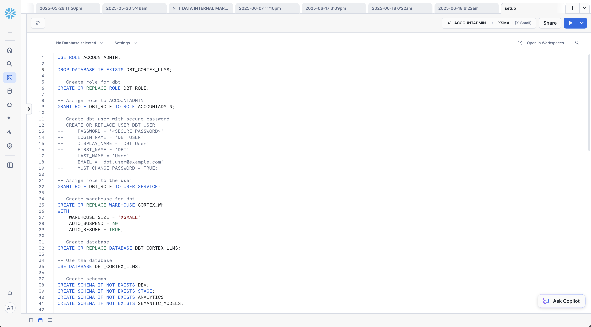
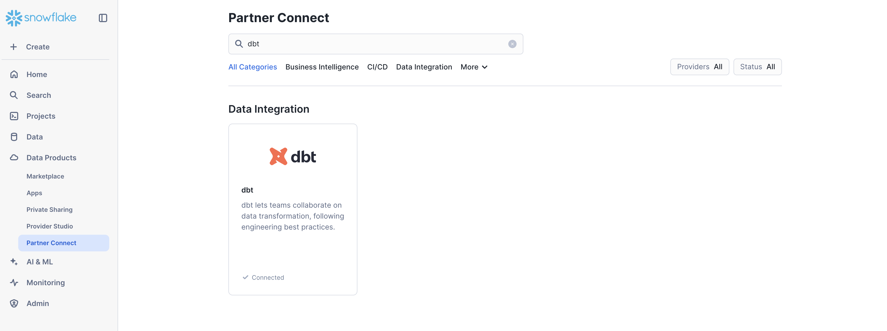
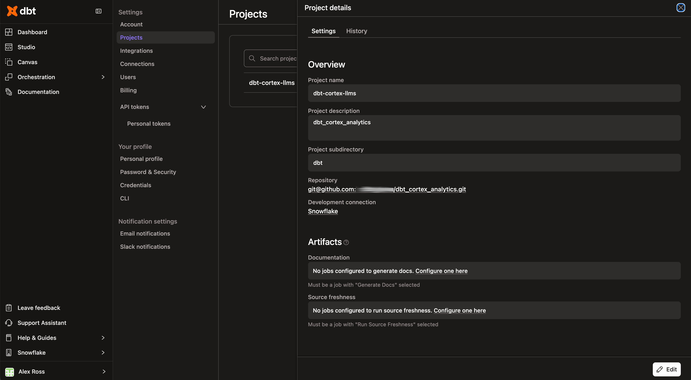
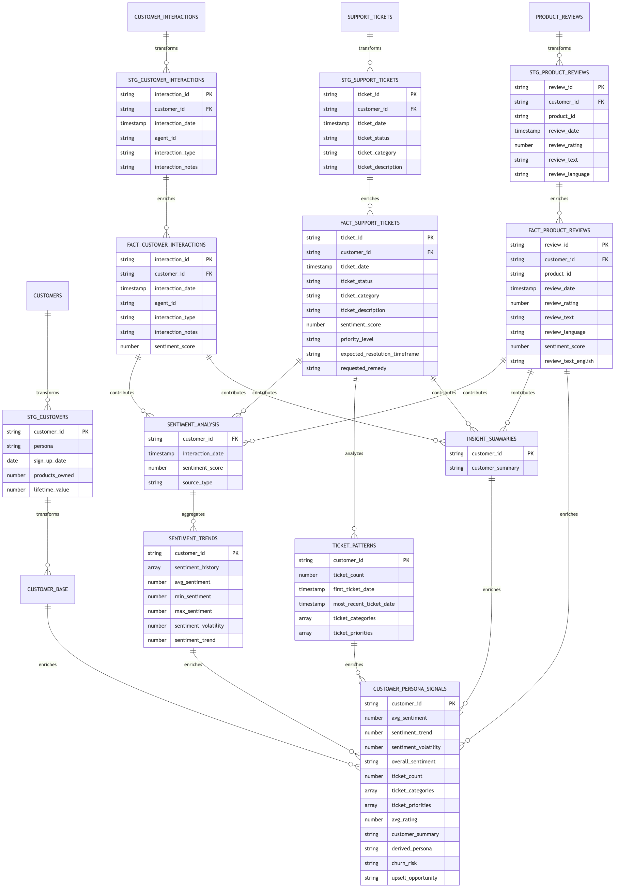
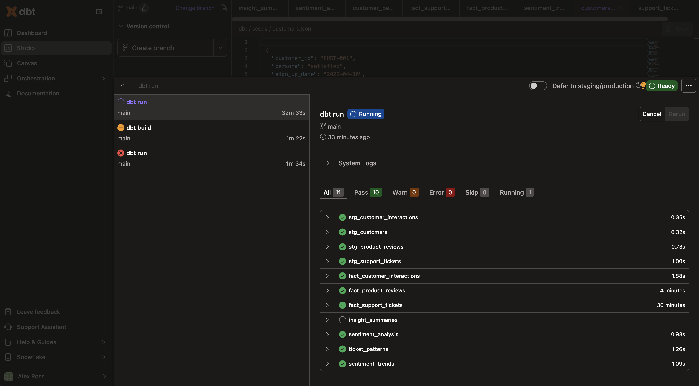
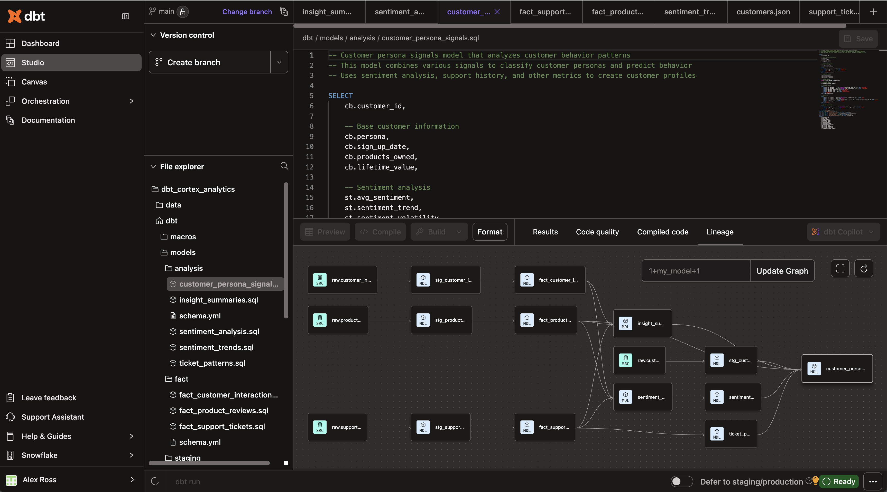
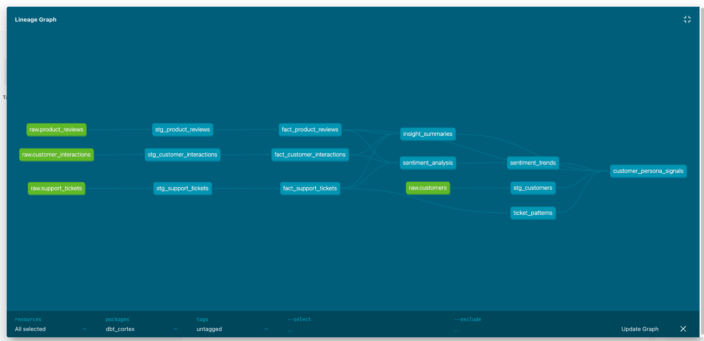
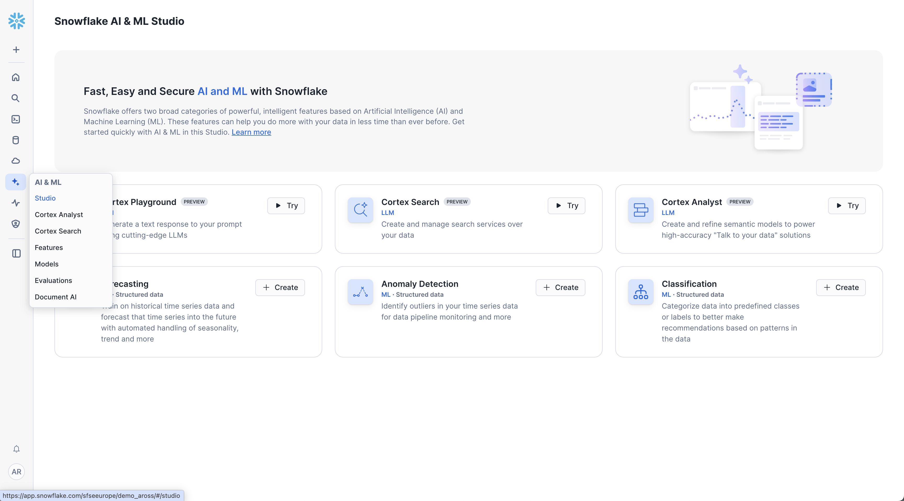
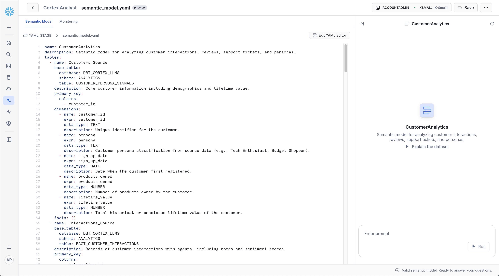

#Customer Intelligence with Snowflake Cortex AI, dbt, and Streamlit
<!-- ------------------------ -->
## Overview 
Duration: 70

Transform your customer analytics with AI-powered insights that reveal hidden patterns in unstructured data. This quickstart demonstrates how to build a comprehensive Customer Intelligence Hub using Snowflake Cortex AI functions, dbt transformations, and interactive Streamlit dashboards.


### What You'll Learn
- Set up Snowflake Cortex AI functions for sentiment analysis and text processing
- Build dbt models that enrich customer data with AI-generated insights
- Deploy interactive Streamlit dashboards with natural language querying
- Create cross-departmental analytics for Marketing, Sales, Support, and Finance teams
- Process multilingual customer feedback automatically

### What You'll Build
- **AI-Enhanced Data Pipeline**: dbt models with Cortex AI sentiment analysis, persona classification, and multilingual processing
- **Customer Intelligence Dashboard**: Interactive Streamlit application with 6 analytical views
- **Cortex Analyst Integration**: Natural language querying of customer data
- **Cross-Channel Analytics**: Unified insights from interactions, reviews, and support tickets

### Prerequisites
- Snowflake account with Cortex AI functions enabled
- Basic SQL and data transformation knowledge
- Python 3.8+ for local development (optional)

### What You'll Need
- 70 minutes to complete
- Snowflake account with ACCOUNTADMIN privileges
- Terminal/command line access for downloading sample data
- Sample customer data (provided)

<!-- ------------------------ -->
## Set Up Snowflake Environment
Duration: 10

First, let's configure your Snowflake account with the necessary database, schemas, and permissions.

### Create Database and Schemas

Execute the following SQL commands in a Snowflake worksheet:

```sql
USE ROLE ACCOUNTADMIN;

-- Create database and schemas
CREATE OR REPLACE DATABASE DBT_CORTEX_LLMS;
USE DATABASE DBT_CORTEX_LLMS;

CREATE SCHEMA IF NOT EXISTS STAGE;
CREATE SCHEMA IF NOT EXISTS ANALYTICS;
CREATE SCHEMA IF NOT EXISTS SEMANTIC_MODELS;

-- Create warehouse for processing
CREATE OR REPLACE WAREHOUSE CORTEX_WH 
WITH 
    WAREHOUSE_SIZE = 'XSMALL' 
    AUTO_SUSPEND = 60
    AUTO_RESUME = TRUE;

-- Create role for dbt operations
CREATE OR REPLACE ROLE DBT_ROLE;
GRANT ROLE DBT_ROLE TO ROLE ACCOUNTADMIN;

-- Grant necessary privileges
GRANT USAGE ON DATABASE DBT_CORTEX_LLMS TO ROLE DBT_ROLE;
GRANT CREATE SCHEMA ON DATABASE DBT_CORTEX_LLMS TO ROLE DBT_ROLE;
GRANT ALL ON ALL SCHEMAS IN DATABASE DBT_CORTEX_LLMS TO ROLE DBT_ROLE;
GRANT ALL ON FUTURE SCHEMAS IN DATABASE DBT_CORTEX_LLMS TO ROLE DBT_ROLE;
GRANT ALL ON ALL TABLES IN DATABASE DBT_CORTEX_LLMS TO ROLE DBT_ROLE;
GRANT ALL ON FUTURE TABLES IN DATABASE DBT_CORTEX_LLMS TO ROLE DBT_ROLE;
GRANT ALL ON ALL VIEWS IN DATABASE DBT_CORTEX_LLMS TO ROLE DBT_ROLE;
GRANT ALL ON FUTURE VIEWS IN DATABASE DBT_CORTEX_LLMS TO ROLE DBT_ROLE;
GRANT ALL ON WAREHOUSE CORTEX_WH TO ROLE DBT_ROLE;
```

### Prepare Data Loading Infrastructure

```sql
USE ROLE DBT_ROLE;
USE WAREHOUSE CORTEX_WH;
USE SCHEMA STAGE;

-- Create file format for JSON data
CREATE OR REPLACE FILE FORMAT JSON_FORMAT
    TYPE = 'JSON'
    STRIP_OUTER_ARRAY = TRUE
    COMPRESSION = 'AUTO';

-- Create stage for raw data
CREATE OR REPLACE STAGE RAW_DATA_STAGE;

-- Create raw tables for customer data
CREATE OR REPLACE TRANSIENT TABLE CUSTOMER_INTERACTIONS (data VARIANT);
CREATE OR REPLACE TRANSIENT TABLE PRODUCT_REVIEWS (data VARIANT);
CREATE OR REPLACE TRANSIENT TABLE SUPPORT_TICKETS (data VARIANT);
CREATE OR REPLACE TRANSIENT TABLE CUSTOMERS (data VARIANT);
```

### Verify Cortex AI Functions

Test that Cortex AI functions are available in your account:

```sql
-- Test sentiment analysis function
SELECT SNOWFLAKE.CORTEX.SENTIMENT('I love this product!') as sentiment_score;

-- Expected result: positive value between 0 and 1
```

If this query fails, ensure your Snowflake account has Cortex AI functions enabled. Contact your Snowflake administrator if needed.

<!-- ------------------------ -->
## Load Initial Data
Duration: 10

Before setting up dbt, we need to load the sample customer data that our transformations will process.

### Download Project Files

Get the project files using one of these methods:

**Option 1: Clone the Repository (Recommended)**
```bash
git clone https://github.com/Snowflake-Labs/dbt_cortex_analytics.git
OR 
https://github.com/alexfrancisross/dbt-cortex-analytics
cd dbt_cortex_analytics
```

**Option 2: Download ZIP File**
1. Go to https://github.com/Snowflake-Labs/dbt_cortex_analytics OR https://github.com/alexfrancisross/dbt-cortex-analytics
2. Click the green "Code" button
3. Select "Download ZIP"
4. Extract the ZIP file and navigate to the extracted folder

### Run Setup Script

Execute the setup script in Snowflake to create the initial data loading infrastructure:

1. **Open Snowsight**: Navigate to your Snowflake account
2. **Create New Worksheet**: Click "Worksheets" → "+" to create a new worksheet
3. **Copy Setup Script**: Copy the contents of `dbt/setup.sql` from your downloaded project and paste into the worksheet


4. **Update File Paths**: Before running, update the PUT commands in the script to match your local file paths:
   ```sql
   -- Update these paths to match your local directory structure
   -- If you're in the project root directory, use:
   PUT file://./dbt/seeds/customer_interactions.json @STAGE.RAW_DATA_STAGE;
   PUT file://./dbt/seeds/product_reviews.json @STAGE.RAW_DATA_STAGE;
   PUT file://./dbt/seeds/support_tickets.json @STAGE.RAW_DATA_STAGE;
   PUT file://./dbt/seeds/customers.json @STAGE.RAW_DATA_STAGE;
   ```
5. **Run Script**: Execute the entire script to set up the environment and load data

### Verify Data Loading

Check that the data was loaded successfully:

```sql
-- Verify data in each table
SELECT COUNT(*) as customer_count FROM DBT_CORTEX_LLMS.STAGE.CUSTOMERS;
SELECT COUNT(*) as interaction_count FROM DBT_CORTEX_LLMS.STAGE.CUSTOMER_INTERACTIONS;
SELECT COUNT(*) as review_count FROM DBT_CORTEX_LLMS.STAGE.PRODUCT_REVIEWS;
SELECT COUNT(*) as ticket_count FROM DBT_CORTEX_LLMS.STAGE.SUPPORT_TICKETS;
```

You should see:
- **10 customers** with diverse personas and demographics
- **20 interactions** with sentiment signals
- **20 reviews** in multiple languages
- **20 support tickets** with various categories

> **Note**: The sample data provided includes 10 customers, 20 interactions, 20 reviews, and 20 support tickets for demonstration purposes. For testing with larger datasets, additional sample files with 1000+ records are available in the `data/samples` folder of the repository.

<!-- ------------------------ -->
## Set Up dbt Cloud via Partner Connect
Duration: 10

Now let's set up dbt Cloud through Snowflake Partner Connect, which automatically configures the connection and creates the necessary resources.

### Access Partner Connect

1. **Login to Snowsight**: Navigate to your Snowflake account
2. **Open Admin Menu**: Click "Admin" in the left navigation
3. **Select Partner Connect**: Click on "Partner Connect"
4. **Find dbt**: Locate the dbt tile and click "Connect"



### Configure dbt Cloud Connection

When you click "Connect" on the dbt tile:

1. **Review Connection Details**: Snowflake will show the resources it will create:
   - Database: `PC_DBT_DB` (we'll modify this)
   - Warehouse: `PC_DBT_WH` (we'll use our `CORTEX_WH` instead)
   - User: `PC_DBT_USER`
   - Role: `PC_DBT_ROLE`

2. **Optional Settings**: You can modify the database name to `DBT_CORTEX_LLMS` to match our setup

3. **Click "Connect"**: This creates the dbt Cloud account and establishes the connection

4. **Complete dbt Cloud Setup**: You'll be redirected to dbt Cloud to complete account setup

### Import the Project

Once in dbt Cloud:

1. **Create New Project**: Click "Create a dbt project"
2. **Choose Connection**: Select the Snowflake connection that was automatically created
3. **Configure Project**: 
   - Project name: `Customer Intelligence Hub`
   - Repository: Import from `https://github.com/Snowflake-Labs/dbt_cortex_analytics.git` OR `https://github.com/alexfrancisross/dbt-cortex-analytics`



### Update Connection Settings

In dbt Cloud, update your connection settings:

1. **Navigate to Account Settings**: Click the gear icon → Account Settings
2. **Select Projects**: Choose your project
3. **Click Connection**: Update the connection details:
   - **Database**: `DBT_CORTEX_LLMS`
   - **Warehouse**: `CORTEX_WH`
   - **Role**: `DBT_ROLE` (or use the auto-created `PC_DBT_ROLE`)

4. **Test Connection**: Click "Test Connection" to verify everything works

### Initialize dbt Project

Now that the connection is configured, let's set up the dbt project:

1. **Open dbt Cloud IDE**: In your dbt Cloud project, click "Develop"
2. **Initialize Project**: If prompted, initialize your project repository
3. **Install Dependencies**: In the command line at the bottom, run:
   ```bash
   dbt deps
   ```

The sample data we loaded in the previous step is now ready for transformation by our dbt models.

<!-- ------------------------ -->
## Build AI-Enhanced Data Models
Duration: 20

Execute the dbt transformations that apply Cortex AI functions to extract insights from customer data.

### Understanding the Data Pipeline

The dbt project follows a three-layer architecture:

1. **Staging Layer**: Clean and structure raw JSON data
2. **Fact Layer**: Core business entities with enriched attributes  
3. **Analytics Layer**: AI-enhanced models with sentiment scores and persona classification



### Run dbt Transformations

Execute the complete data pipeline in dbt Cloud:

1. **Run All Models**: In the dbt Cloud IDE command line, execute:
```bash
dbt run
```



2. **Run Tests**: Validate data quality with tests:
   ```bash
   dbt test
   ```

3. **Generate Documentation**: Create project documentation:
```bash
dbt docs generate
   ```

4. **View Documentation**: Click the "View Docs" button in the IDE to explore your data lineage and model documentation



### Key Models Created

The pipeline creates several important models:

**Staging Models:**
- `stg_customers`: Cleaned customer profile data
- `stg_customer_interactions`: Parsed interaction notes
- `stg_product_reviews`: Structured review data with language detection
- `stg_support_tickets`: Categorized support requests

**Fact Models with AI Enhancement:**
- `fact_customer_interactions`: Interactions with sentiment scores using `SNOWFLAKE.CORTEX.SENTIMENT`
- `fact_product_reviews`: Reviews with sentiment analysis and automatic translation
- `fact_support_tickets`: Tickets with AI-powered priority scoring

**Analytics Models:**
- `customer_persona_signals`: Comprehensive customer profiles with churn risk and upsell opportunity scoring
- `sentiment_analysis`: Cross-channel sentiment tracking
- `sentiment_trends`: Temporal analysis of customer satisfaction



### Verify AI-Enhanced Data

Check that Cortex AI functions are working correctly:

```sql
-- View sentiment-enhanced interactions
SELECT 
    customer_id,
    interaction_notes,
    sentiment_score,
    CASE 
        WHEN sentiment_score > 0.3 THEN 'Positive'
        WHEN sentiment_score < -0.3 THEN 'Negative'
        ELSE 'Neutral'
    END as sentiment_category
FROM DBT_CORTEX_LLMS.ANALYTICS.FACT_CUSTOMER_INTERACTIONS
LIMIT 10;

-- Check multilingual review processing
SELECT 
    review_language,
    review_text,
    review_text_english,
    sentiment_score
FROM DBT_CORTEX_LLMS.ANALYTICS.FACT_PRODUCT_REVIEWS
WHERE review_language != 'en'
LIMIT 5;
```

<!-- ------------------------ -->
## Deploy Cortex Analyst Semantic Model
Duration: 10

Set up Cortex Analyst to enable natural language querying of your customer data.

### Create Semantic Model in Snowsight

The project includes a pre-configured semantic model that defines the business entities and relationships for natural language queries. You can create this semantic model directly in the Snowsight web interface.

1. **Access Snowsight AI & ML Studio**: 
   - Login to your Snowflake account
   - Navigate to the AI & ML Studio in the left sidebar
   - Click on "Cortex Analyst" in the left navigation panel



2. **Create New Semantic Model**:
   - Click "Try" on the Cortex Analyst tile or navigate directly to Cortex Analyst
   - Click "Create" to start building a new semantic model
   - Enter the name: `CustomerAnalytics`
   - Select your database: `DBT_CORTEX_LLMS`
   - Create or select the schema: `SEMANTIC_MODELS`

3. **Configure the Semantic Model**:
   - In the semantic model editor, you'll see a YAML editor interface
   - Clear any default content and copy the complete semantic model definition from the project



4. **Copy Semantic Model Definition**:
   - Navigate to the `streamlit/cortex_analyst/semantic_model.yaml` file in your project
   - Copy the entire contents of this file
   - Paste it into the semantic model editor in Snowsight
   - The YAML defines all tables, dimensions, measures, and relationships for your customer data

5. **Save the Semantic Model**:
   - Click "Save" to create the semantic model
   - The system will validate the YAML structure and create the semantic model
   - You should see a confirmation that the semantic model was created successfully

> **Alternative Method**: If you prefer using the command line, you can also use the provided script:
> ```bash
> cd streamlit/cortex_analyst
> bash upload_semantic_model.sh
> ```

### Verify Semantic Model

Confirm the semantic model was created successfully:

    ```sql
-- List semantic models
SHOW SEMANTIC MODELS IN SCHEMA DBT_CORTEX_LLMS.SEMANTIC_MODELS;

-- Test with a simple query
SELECT SNOWFLAKE.CORTEX.ANALYST(
    'Show me the top 5 customers by total interactions',
    'DBT_CORTEX_LLMS.SEMANTIC_MODELS.CUSTOMERANALYTICS'
) as analyst_response;
```

The semantic model enables business users to query customer data using natural language like:
- "Which customers have the most negative sentiment?"
- "Show me support ticket trends by category"
- "What are the common themes in product reviews?"

<!-- ------------------------ -->
## Deploy Streamlit Dashboard
Duration: 15

Deploy the interactive Customer Intelligence Hub dashboard to Snowflake.

### Configure Deployment Script

The project includes an automated deployment script. First, configure your Snowflake CLI connection:

    ```bash
# Configure Snowflake CLI (if not already done)
snow connection add --connection-name default \
    --account <your-account> \
    --user <your-username> \
    --role DBT_ROLE \
    --warehouse CORTEX_WH \
    --database DBT_CORTEX_LLMS
```

### Deploy the Application

Since you already have the project files, deploying the Streamlit application is straightforward:

1. **Navigate to Streamlit Directory**: 
   ```bash
   # From the project root directory
   cd streamlit
   ```

2. **Make Script Executable and Deploy**:
   ```bash
   # Make deployment script executable
   chmod +x deploy_streamlit_to_snowflake.sh
   
   # Deploy the Streamlit application
   ./deploy_streamlit_to_snowflake.sh
   ```

The deployment script:
1. Creates a Snowflake stage for application files
2. Uploads all Streamlit components (Python files, SQL queries, assets)
3. Creates the Streamlit application in Snowflake
4. Configures the application to use your data warehouse

### Access Your Dashboard

1. **Login to Snowsight**: Navigate to your Snowflake account
2. **Open Streamlit Apps**: Click "Streamlit" in the left navigation
3. **Launch Customer Intelligence Hub**: Click on `customer_intelligence_hub`

The dashboard includes six analytical views:

**📊 Overview**: KPIs, sentiment trends, and churn risk analysis
**🎯 Segmentation**: Customer persona analysis and value segmentation  
**💭 Sentiment Experience**: Cross-channel sentiment tracking and recovery metrics
**📝 Product Feedback**: Review analysis with multi-language support
**🎧 Support Operations**: Ticket analytics and resolution metrics
**🤖 Cortex Analyst**: Natural language querying interface

<!-- ------------------------ -->
## Explore Customer Intelligence Insights
Duration: 10

Now let's explore the powerful insights your AI-enhanced customer intelligence platform provides.

### Business Value by Department

**Marketing Teams** can now:
- Target campaigns based on detected customer sentiment
- Process feedback in any language automatically
- Identify brand advocates with high positive sentiment
- Create personalized messaging based on specific customer concerns

**Sales Teams** can:
- Prioritize retention efforts on high churn-risk accounts
- Identify perfect timing for upgrade conversations  
- Tailor pitches to address specific detected concerns
- Access sentiment-aware conversation starters

**Support Teams** can:
- Auto-prioritize tickets based on detected urgency and sentiment
- Identify at-risk customers before escalation occurs
- Provide agents with sentiment context before conversations
- Track sentiment recovery rates after interactions

**Finance Teams** can:
- Forecast revenue risk from sentiment trends
- Anticipate refund requests before they occur
- Identify payment friction points from support tickets
- Prioritize billing issues by detected urgency

### Key Insights Available

**Cross-Channel Sentiment Analysis**: Track how customer sentiment varies across interactions, reviews, and support tickets to identify consistency issues.

**Multilingual Feedback Processing**: Automatically process and analyze customer feedback in English, Spanish, French, German, Italian, and Portuguese.

**Predictive Customer Scoring**: AI-powered churn risk and upsell opportunity scores based on sentiment patterns and behavior.

**Persona-Based Segmentation**: Automatic customer classification into personas like "Satisfied," "Frustrated," "Mixed," and "Improving" based on AI analysis.

### Sample Analytical Queries

Try these natural language queries in the Cortex Analyst interface:

```
"Show me customers with declining sentiment trends"
"Which product categories have the most negative reviews?"  
"What are the common themes in high-priority support tickets?"
"Compare sentiment scores across different interaction channels"
"Identify customers at high risk of churning"
```

<!-- ------------------------ -->
## Validation and Testing
Duration: 5

Verify that your Customer Intelligence Hub is working correctly.

### Data Quality Checks

Run these queries to validate your AI-enhanced data:

```sql
-- Check sentiment score distribution
SELECT 
    CASE 
        WHEN sentiment_score > 0.3 THEN 'Positive'
        WHEN sentiment_score < -0.3 THEN 'Negative'
        ELSE 'Neutral'
    END as sentiment_category,
    COUNT(*) as count
FROM DBT_CORTEX_LLMS.ANALYTICS.FACT_CUSTOMER_INTERACTIONS
GROUP BY sentiment_category;

-- Verify multilingual processing
SELECT 
    review_language,
    COUNT(*) as review_count,
    AVG(sentiment_score) as avg_sentiment
FROM DBT_CORTEX_LLMS.ANALYTICS.FACT_PRODUCT_REVIEWS
GROUP BY review_language
ORDER BY review_count DESC;

-- Check customer persona distribution
SELECT 
    derived_persona,
    churn_risk,
    COUNT(*) as customer_count
FROM DBT_CORTEX_LLMS.ANALYTICS.CUSTOMER_PERSONA_SIGNALS
GROUP BY derived_persona, churn_risk
ORDER BY customer_count DESC;
```

### Dashboard Functionality Test

In your Streamlit dashboard:

1. **Overview Tab**: Verify KPI cards show realistic metrics and charts load properly
2. **Segmentation Tab**: Check that customer personas are distributed logically
3. **Sentiment Experience Tab**: Confirm sentiment trends show over time
4. **Product Feedback Tab**: Test language filtering and rating distributions
5. **Support Operations Tab**: Validate ticket volume and resolution metrics
6. **Cortex Analyst Tab**: Test natural language queries return relevant results

### Success Criteria

✅ All dbt models run without errors  
✅ Sentiment scores are calculated for customer interactions  
✅ Multilingual reviews are translated to English  
✅ Customer personas are classified automatically  
✅ Streamlit dashboard loads and displays data  
✅ Cortex Analyst responds to natural language queries  

<!-- ------------------------ -->
## Troubleshooting
Duration: 5

Common issues and solutions:

### Data Loading Issues

**Problem**: PUT commands fail or data files not found  
**Solution**: 
- Ensure you've downloaded all sample data files to the correct local directory
- Verify file paths in the PUT commands match your local directory structure
- Check that you're running the commands from the correct directory
- Ensure files are accessible and not corrupted

**Problem**: COPY INTO commands fail  
**Solution**: 
- Verify the stage `RAW_DATA_STAGE` was created successfully
- Check that files were uploaded to the stage using `LIST @STAGE.RAW_DATA_STAGE;`
- Ensure the JSON file format is correctly defined
- Review error messages for specific data format issues

### dbt Cloud Connection Issues

**Problem**: dbt Cloud connection test fails  
**Solution**: 
- Verify the connection settings in dbt Cloud match your Snowflake setup
- Ensure the warehouse `CORTEX_WH` is running and accessible
- Check that the database `DBT_CORTEX_LLMS` exists
- Verify the role has necessary permissions (use `DBT_ROLE` or `PC_DBT_ROLE`)
- If using Partner Connect, ensure the auto-created resources are properly configured

### Cortex AI Function Errors

**Problem**: Sentiment analysis functions return errors  
**Solution**: 
- Verify your Snowflake account has Cortex AI enabled
- Check you're using supported regions for Cortex functions
- Ensure text inputs are not null or empty

### Streamlit Deployment Failures

**Problem**: Deployment script fails  
**Solution**: 
- Verify Snowflake CLI is installed and configured
- Check connection name matches script configuration
- Ensure you have CREATE STREAMLIT privileges

### Data Quality Issues

**Problem**: Unexpected sentiment scores or missing translations  
**Solution**: 
- Check for null values in source data
- Verify text fields contain actual text content
- Review dbt model logic for data type casting

### Performance Optimization

**Problem**: Queries or dashboard loading slowly  
**Solution**: 
- Increase warehouse size for large datasets
- Add appropriate indexes on frequently queried columns
- Consider materializing views as tables for better performance

<!-- ------------------------ -->
## Next Steps
Duration: 5

Congratulations! You've built a comprehensive Customer Intelligence Hub powered by AI. Here are ways to extend and customize your solution:

### Extend the Data Pipeline

- **Add New Data Sources**: Incorporate chat logs, social media mentions, or survey responses
- **Custom Cortex Functions**: Experiment with TRANSLATE, SUMMARIZE, and COMPLETE functions
- **Advanced Analytics**: Build predictive models for customer lifetime value or next-best-action recommendations

### Enhance the Dashboard

- **Custom Visualizations**: Add new charts and metrics specific to your business
- **Real-time Updates**: Implement streaming data pipelines for live sentiment tracking
- **Mobile Optimization**: Customize the Streamlit interface for mobile devices
- **Role-based Access**: Implement user authentication and department-specific views

### Operationalize the Solution

- **Automated Scheduling**: Set up dbt Cloud jobs to refresh data regularly using the built-in scheduler
- **Data Quality Monitoring**: Implement automated tests and alerts for data anomalies using dbt Cloud's monitoring features
- **Performance Monitoring**: Track query performance and optimize as data volume grows
- **Security Hardening**: Implement row-level security and data masking for sensitive information
- **CI/CD Integration**: Use dbt Cloud's Git integration for version control and deployment workflows

### Advanced AI Applications

- **Conversation Intelligence**: Analyze support call transcripts for coaching opportunities
- **Product Intelligence**: Extract feature requests and improvement ideas from reviews
- **Risk Intelligence**: Predict customer churn probability and intervention strategies
- **Content Intelligence**: Generate automated responses to common customer inquiries

### Business Integration

- **CRM Integration**: Sync insights back to Salesforce, HubSpot, or other CRM systems
- **Marketing Automation**: Trigger campaigns based on sentiment changes
- **Support Automation**: Auto-route tickets based on sentiment and urgency scores
- **Executive Reporting**: Create automated executive dashboards with key insights

### Learning Resources

- [Snowflake Cortex AI Documentation](https://docs.snowflake.com/en/user-guide/cortex-llm)
- [dbt Best Practices Guide](https://docs.getdbt.com/guides/best-practices)
- [Streamlit in Snowflake Documentation](https://docs.snowflake.com/en/developer-guide/streamlit/about-streamlit)
- [Advanced Analytics with Snowpark](https://docs.snowflake.com/en/developer-guide/snowpark/index)

### Community and Support

- Join the [dbt Community Slack](https://getdbt.slack.com) for dbt-specific questions
- Visit [Snowflake Community](https://community.snowflake.com) for platform support
- Explore [Snowflake Quickstarts](https://quickstarts.snowflake.com) for more advanced tutorials

You now have a foundation that bridges structured data with human communication insights, enabling data-driven decisions that improve customer relationships and business outcomes.

<!-- ------------------------ -->
## Conclusion
Duration: 2

You've successfully built an AI-powered Customer Intelligence Hub that transforms how your organization understands and responds to customer needs. This solution demonstrates the power of combining Snowflake's Cortex AI functions with modern data stack tools like dbt and Streamlit.

### What You've Accomplished

✅ **Built an AI-Enhanced Data Pipeline**: Automated sentiment analysis, multilingual processing, and persona classification  
✅ **Created Cross-Departmental Analytics**: Unified insights for Marketing, Sales, Support, and Finance teams  
✅ **Deployed Interactive Dashboards**: Self-service analytics with natural language querying  
✅ **Established Scalable Architecture**: Foundation for expanding to additional data sources and use cases  

### Key Takeaways

- **AI Integration**: Snowflake Cortex functions seamlessly integrate AI capabilities into standard SQL workflows
- **Modern Data Stack**: dbt + Snowflake + Streamlit provides a powerful, scalable analytics platform
- **Business Value**: AI-powered insights enable proactive customer relationship management
- **Multilingual Support**: Automatic translation breaks down language barriers in global customer analytics

### Business Impact

Your Customer Intelligence Hub enables:
- **Proactive Customer Success**: Identify at-risk customers before they churn
- **Personalized Experiences**: Tailor interactions based on sentiment and behavior patterns  
- **Operational Efficiency**: Prioritize support resources based on urgency and impact
- **Revenue Growth**: Identify upsell opportunities and optimize customer lifetime value

The foundation you've built can scale to handle enterprise-level customer data while maintaining the flexibility to adapt to changing business requirements. Your organization now has the tools to turn customer conversations into competitive advantages.

Throughout this quickstart, you've seen how the modern data stack components work together seamlessly - from the intuitive dbt Cloud interface for data transformations to the comprehensive data lineage visualization that helps you understand your pipeline's flow and dependencies.